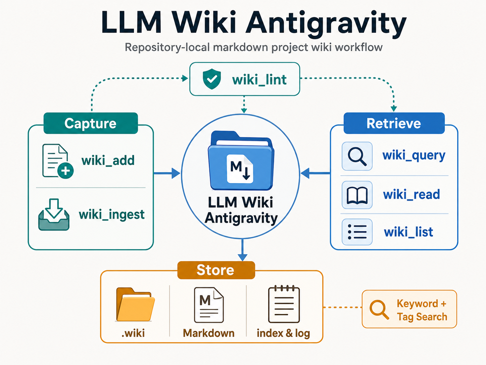

# llm-wiki-antigravity



`llm-wiki-antigravity`는 저장소 안에 프로젝트 지식을 직접 남기고 다시 찾아볼 수 있게 하는 경량 Markdown 위키 워크플로입니다. LLM 코딩 세션에서 나온 결정, 패턴, 디버깅 기록, 환경 정보, 세션 로그를 `.wiki/` 아래에 구조화해 보관하고, PowerShell 또는 sh 엔트리포인트로 추가, 조회, 검증할 수 있습니다.

## 핵심 기능

- 저장소 로컬 `.wiki/` 디렉터리에 Markdown 페이지, 인덱스, 변경 로그를 생성합니다.
- `wiki_add`와 `wiki_ingest`로 구조화된 프로젝트 지식을 기록합니다.
- `wiki_query`, `wiki_read`, `wiki_list`로 기존 지식을 다시 찾습니다.
- `wiki_lint`로 잘못된 카테고리, 중복 slug, 깨진 위키 링크를 점검합니다.
- Windows PowerShell과 POSIX sh 환경을 모두 지원합니다.

## 저장 구조

```text
.wiki/
  index.md   # 카테고리별 위키 인덱스
  log.md     # 위키 변경 로그
  *.md       # 개별 지식 페이지
```

지원 카테고리는 `architecture`, `decision`, `pattern`, `debugging`, `environment`, `session-log`, `reference`, `convention`입니다.

## 사용법

Windows PowerShell:

```powershell
.\.agents\workflows\wiki.ps1 wiki_add -InputJson '{"title":"Auth Architecture","content":"...","tags":["auth"],"category":"architecture"}' -Json
.\.agents\workflows\wiki.ps1 wiki_query -InputJson '{"query":"auth","tags":["auth"]}' -Json
.\.agents\workflows\wiki.ps1 wiki_lint -Json
```

sh/bash:

```sh
./.agents/workflows/wiki.sh wiki_add --input '{"title":"Auth Architecture","content":"...","tags":["auth"],"category":"architecture"}' --json
./.agents/workflows/wiki.sh wiki_query --input '{"query":"auth","tags":["auth"]}' --json
./.agents/workflows/wiki.sh wiki_lint --json
```

## 워크플로

1. 기록할 내용을 `title`, `content`, `tags`, `category` 형태의 JSON으로 전달합니다.
2. 워크플로가 제목을 slug로 변환하고 `.wiki/<slug>.md` 파일을 생성하거나 갱신합니다.
3. `.wiki/index.md`와 `.wiki/log.md`가 함께 갱신됩니다.
4. 필요할 때 키워드, 태그, 카테고리로 조회합니다.
5. 변경 후 `wiki_lint`로 위키 상태를 확인합니다.

## 제약 사항

- 검색은 키워드와 태그 기반입니다. 임베딩이나 의미 검색을 사용하지 않습니다.
- 세션 내용은 자동 저장되지 않습니다. 남겨야 할 내용은 `wiki_add` 또는 `wiki_ingest`로 명시적으로 기록해야 합니다.
- Windows에서는 PowerShell 엔트리포인트인 `.agents/workflows/wiki.ps1` 사용을 권장합니다.

## 라이선스

MIT License
